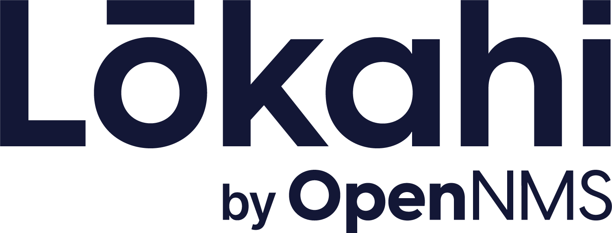
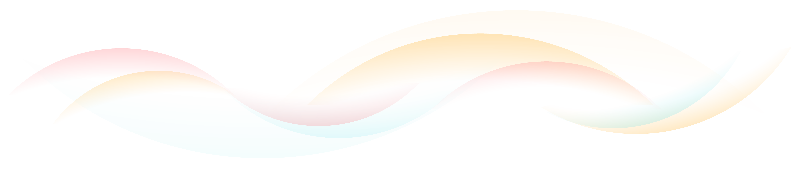

</a>

Lōkahi (pronounced "loh-KAH-hee") is an open source network monitoring project designed for Cloud-native deployments: the next generation of OpenNMS Horizon.
Both the word _lōkahi_, which means unity, unison, and harmony, and David Hustace, one of The OpenNMS Group's founders, share Hawaiian roots.

The OpenNMS project is 23 years young.
Under continuous development during that time, it has evolved into a premier network monitoring solution with unparalleled scalability and reliability, deployed in many of the world's largest networks.
During this period, IT infrastructure has undergone a revolution based on virtualization technologies, culminating in a move from traditional data center technologies to Cloud-based solutions.

This project continues that open source collaboration, to design a solution that is deployed in a way that aligns with industry trends towards elastic, Cloud-native computing.

The Lōkahi project allows us to collaborate and move quickly to achieve the project's goals much more rapidly than we could by refactoring the OpenNMS Horizon project.
This way, Horizon continues to evolve as a community project and users can still count on Meridian for continuous improvement and deployment in traditional production environments.

Lōkahi aims to provide the following:

* A modern, intuitive user experience to accomplish network monitoring tasks quickly
* Multi-tenancy for any organization that wants to isolate their monitoring environments 
* A cloud-native service built using a microservices design and orchestrated using Kubernetes
* A solution that implements industry and de facto monitoring standards with dynamically deployed plugins for collecting monitoring data and synthetically testing network services
* A resilient distributed monitoring system that can be easily deployed to scale horizontally for any monitoring workload
* A system that can extend its monitoring capabilities, and integrate into corporate incident management workflows, via streaming and plugin APIs

This project is in early and active development, adding new features continually.

For more details on the motivation behind the project and some high-level goals, see the [Introducing Lōkahi by OpenNMS](https://www.opennms.com/en/blog/2023-06-07-introducing-lokahi-by-opennms/) blog post.

## Installation

OpenNMS Lōkahi uses PostgreSQL as a relational database for its inventory and configuration, and big data systems such as Cortex and Elasticsearch for persistence of historical monitoring data.

Our current goal is that you can develop and run Lōkahi on a development system on the following platforms:

* Linux x86 (`x86_64-unknown-linux-gnu`)
* Darwin x86 (`x86_64-apple-darwin`)
* Darwin arm (1aarch64-apple-darwin1)

Lōkahi requires a Kubernetes-compatible infrastructure for deploying the application.

For installation instructions, see the [administrator's getting started guide](https://github.com/OpenNMS-Cloud/lokahi/wiki/Getting-Started---Admin) in the project's wiki on GitHub.

## How to contribute

We welcome community contributions from anyone!
There are a lot of moving parts and churn in this early phase so we recommend contacting us in our [OpenNMS Development](https://chat.opennms.com/opennms/channels/opennms-development) channel to share your thoughts.

Read the [Development Guidelines](https://github.com/OpenNMS-Cloud/lokahi/wiki/Development-Guidelines) to learn how you can run tests and make your first contribution.

The project is written mainly in Java and Golang.

To contact Lōkahi users and developers, join the following channels in our Mattermost chat:

* [OpenNMS Discussion](https://chat.opennms.com/opennms/channels/opennms-discussion) for general questions on how to use it and to learn concepts
* [OpenNMS Development](https://chat.opennms.com/opennms/channels/opennms-development) to learn how to build Lōkahi from the source code and how to contribute to its functionality

## Documentation

We use the [GitHub Wiki](https://github.com/OpenNMS-Cloud/lokahi/wiki) in the Lōkahi GitHub repository to document the project.
Eventually we will migrate the documentation to a `/docs` repo within the project for a more sophisticated versioned documentation framework.

The following sections might be of most interest:

* Installation in the [administrator's getting started guide](https://github.com/OpenNMS-Cloud/lokahi/wiki/Getting-Started---Admin)
* Building from source in the [developers getting started](https://github.com/OpenNMS-Cloud/lokahi/wiki/Getting-Started) section
* [Troubleshooting](https://github.com/OpenNMS-Cloud/lokahi/wiki/Troubleshooting) for quick help

## License

The software is licensed under the GNU Affero General Public License 3.0.

